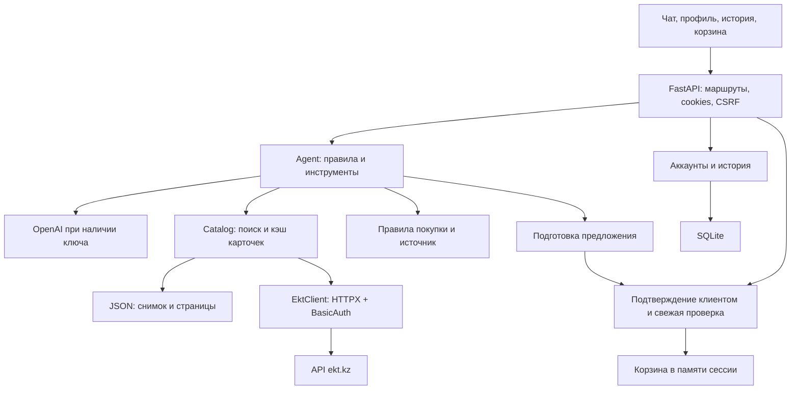

# HACKALEM AI — консультант ekt.kz от команды Logic3

Прототип ИИ-ассистента для кейса ТОО «Электрокомплект»: поиск электротехнических товаров, консультация по характеристикам и наличию, подбор аналогов, ответы об условиях покупки и добавление в корзину после подтверждения клиента. Интерфейс включает регистрацию, профиль и сохранение диалогов авторизованных пользователей.

**Для работы ИИ добавьте свой `OPENAI_API_KEY` в файл `.env` в корне репозитория.** Ключ каталога EKT и ключ OpenAI — разные настройки. Без OpenAI остаются поиск, кнопки товаров и базовые сценарии по правилам; свободный диалог через модель и распознавание JPEG требуют ключа.

Корзина демонстрационная: она работает внутри прототипа, не создаёт заказ на ekt.kz и не принимает платёжные данные. Аккаунты также принадлежат прототипу и не связаны с аккаунтами магазина.

## Возможности

| Возможность | Текущая реализация |
| --- | --- |
| Поиск | По ID, артикулу, названию, бренду и параметрам; локальный индекс каталога |
| Карточка | Цена, остатки, склады, характеристики, описание и сертификаты, если они предоставлены API |
| Аналоги | Сравнение категории и известных критических характеристик с объяснением совпадений |
| Условия покупки | Ответы по запрошенной теме: оплата, доставка, минимальная партия; ссылка на источник |
| Корзина | Предложение → подтверждение → повторная проверка цены и остатка → ссылка `/cart` |
| Аккаунт | Регистрация, вход, выход, редактирование профиля и смена пароля |
| История | Несколько диалогов, восстановление переписки, выбор по дате, предыдущие сообщения и удаление диалога |
| Вложения | PDF с текстом, DOCX, XLSX; JPEG через OpenAI |
| Интерфейс | Адаптивный HTML/CSS/JavaScript без отдельной сборки frontend |

## Быстрый запуск

Нужны **Python 3.11+** и Git. Команды выполняются из корня репозитория — папки с `app/`, `requirements.lock.txt` и `.env.example`.

```bash
git clone https://github.com/BAITC-Hacks/hack-b9b0809e-logic3.git
cd hack-b9b0809e-logic3
```

Если репозиторий уже скачан, откройте его папку в VS Code и используйте встроенный терминал.

### Windows / PowerShell

```powershell
python -m venv .venv
.\.venv\Scripts\python.exe -m pip install -r requirements.lock.txt
if (-not (Test-Path .env)) { Copy-Item .env.example .env }
```

### Linux / macOS

```bash
python3 -m venv .venv
.venv/bin/python -m pip install -r requirements.lock.txt
[ -f .env ] || cp .env.example .env
```

`requirements.lock.txt` фиксирует версии зависимостей; `requirements.txt` содержит диапазоны для их обновления. Активация виртуального окружения для приведённых команд не требуется.

### Настройка API-ключа ИИ

Откройте **`.env`**, а не `.env.example`, и заполните ключ:

```dotenv
EKT_MODE=demo
OPENAI_API_KEY=ваш_ключ_OpenAI
OPENAI_MODEL=gpt-4.1-mini
```

Замените `ваш_ключ_OpenAI` настоящим ключом из своего аккаунта. Модель должна быть доступна вашему аккаунту и поддерживать Chat Completions с вызовом инструментов; для JPEG также нужна поддержка изображений. Запросы к OpenAI оплачиваются по условиям вашего аккаунта.

Для проверки без OpenAI оставьте `OPENAI_API_KEY=` пустым. Вместе с `EKT_MODE=demo` это позволяет запустить базовый сценарий на синтетических товарах без внешних API. При заполненном ключе даже в `demo` используются запросы к OpenAI.

**Не публикуйте `.env` и ключи в GitHub.** Файл исключён через `.gitignore`; в `.env.example` секреты должны оставаться пустыми. После изменения `.env` перезапустите сервер.

### Запуск сервера

Windows / PowerShell:

```powershell
.\.venv\Scripts\python.exe -m uvicorn app.main:app --reload
```

Linux / macOS:

```bash
.venv/bin/python -m uvicorn app.main:app --reload
```

| Адрес | Назначение |
| --- | --- |
| [http://127.0.0.1:8000/](http://127.0.0.1:8000/) | Чат и поиск |
| [http://127.0.0.1:8000/profile](http://127.0.0.1:8000/profile) | Аккаунт и профиль |
| [http://127.0.0.1:8000/cart](http://127.0.0.1:8000/cart) | Просмотр текущей корзины |
| [http://127.0.0.1:8000/docs](http://127.0.0.1:8000/docs) | OpenAPI / Swagger |
| [http://127.0.0.1:8000/health](http://127.0.0.1:8000/health) | Состояние сервера и каталога |

Если порт занят, добавьте `--port 8001` и открывайте адреса с этим портом. Используйте **один worker**: сессии и корзины хранятся в памяти процесса.

## Реальный каталог EKT

Заполните в `.env` реквизиты партнёра:

```dotenv
EKT_MODE=live
EKT_API_BASE=https://ekt.kz/api
EKT_API_USER=apiuser
EKT_API_PASSWORD=пароль_из_доступа_партнёра
```

Клиент использует BasicAuth и два endpoint:

- `GET /products?page=1&per_page=100` — страница списка товаров;
- `GET /products/detail?id=515291` — подробная карточка.

Перед первой демонстрацией рекомендуется загрузить каталог **до запуска сервера**:

```powershell
.\.venv\Scripts\python.exe -m scripts.sync_catalog
```

В Linux/macOS замените интерпретатор на `.venv/bin/python`. Скрипт всегда обращается к реальному API, даже если в `.env` оставлен `EKT_MODE=demo`. Для поиска по этой выгрузке серверу нужен `EKT_MODE=live`.

Синхронизация проходит страницы до пустой или неполной страницы. Поле API `count` означает число элементов страницы, а не размер всего каталога. По умолчанию запрашивается 100 товаров на страницу, одновременно выполняется до четырёх запросов. Есть таймауты и ограниченные повторы при сетевых ошибках, HTTP 429 и 5xx.

Полный снимок сохраняется в `data/catalog-cache.json`, промежуточные страницы — в `data/catalog-cache.pages/`. Повторный запуск использует свежие сохранённые страницы; `--force` повторно запрашивает все страницы. Не запускайте несколько процессов синхронизации одновременно.

Сервер восстанавливает снимок с диска и обновляет устаревший каталог в фоне. При сбое обновления сохраняется предыдущая полная версия. Достижение `CATALOG_MAX_PAGES` без конца списка не считается успешной полной выгрузкой. Смена API, пользователя или размера страницы инвалидирует прежний кэш источника.

В `/health` проверяйте `catalog_loaded`, `loaded_products`, `partial_catalog`, `catalog_stale`, `catalog_syncing` и `catalog_error`. `status: "ok"` означает работоспособность HTTP-сервера, но само по себе не подтверждает готовность каталога. Без начального снимка поиск может временно сообщать, что каталог загружается.

## Архитектура решения

Стек: Python, FastAPI, Pydantic, HTTPX, SQLite и HTML/CSS/JavaScript. OpenAI подключён напрямую через HTTPX и Function Calling. Поиск использует локальный инвертированный индекс; LangChain, ChromaDB и векторная база в текущей версии не используются.



| Модуль | Ответственность |
| --- | --- |
| `app/main.py` | API, жизненный цикл, сессии и интеграция истории |
| `app/config.py`, `app/models.py` | Настройки и проверяемые контракты данных |
| `app/ekt.py` | BasicAuth, запросы к EKT, ошибки и нормализация карточек |
| `app/catalog.py`, `app/catalog_store.py` | Загрузка, кэш, снимки и подбор аналогов |
| `app/search.py` | Индекс, нормализация запросов, артикулы и параметры |
| `app/agent.py` | Маршрутизация, инструменты и вызовы OpenAI |
| `app/cart.py` | Предложения, подтверждения, проверка количества и корзина |
| `app/purchase_terms.py` | Оплата, доставка и минимальная партия |
| `app/accounts.py`, `app/auth.py` | SQLite, пароли, авторизация и профиль |
| `app/chat_history.py` | Диалоги, сообщения, права владельца, даты и контекст модели |
| `app/uploads.py` | Текст документов и распознавание JPEG |
| `static/` | Интерфейс чата, аккаунта, истории и корзины |
| `data/demo.json` | Синтетический каталог |
| `scripts/`, `tests/` | Синхронизация, проверка live API и тесты |

Инструменты агента: `search_products`, `get_product_details`, `check_stock`, `find_analogs`, `purchase_terms`, `prepare_cart_addition`. Аргументы проверяются Pydantic. Модель выбирает инструменты, а фактические ответы формируются из их результатов. `add_to_cart` не доступен модели как инструмент.

## Используемые данные

### Товары и поиск

В `demo` используются **пять синтетических товаров** из [data/demo.json](data/demo.json): автоматы, кабель и лампа. Их цены и остатки не относятся к реальному магазину. У `demo-101` остаток нулевой, у подходящего аналога `demo-102` — 12 единиц.

В `live` источником служит API партнёра. Загружается весь доступный через пагинацию список, подробные карточки запрашиваются по мере необходимости. Количество товаров определяется конкретной выгрузкой и отображается в `/health`, фиксированное число не зашито в код.

| Поле `Product` | Содержание |
| --- | --- |
| `id`, `article`, `name`, `category` | Идентификатор, артикул, название и категория |
| `price`, `stock` | Цена в тенге и остаток; `stock` нормализуется из `quantity` API |
| `stores` | Данные по складам |
| `properties`, `description` | Характеристики и описание |
| `certificates`, `url` | Ссылки сертификатов и товара; принимаются безопасные HTTPS-ссылки ekt.kz |
| `minimum` | Минимум/кратность из `KRATNOST_MIN`, при отсутствии — техническое значение 1 |
| `warnings` | Обнаруженные противоречия характеристик |

Неизвестные цена и остаток обозначаются `null`, а не нулём: добавление блокируется. Отсутствующие сертификаты не придумываются. Значение `minimum=1` при отсутствии поля не подтверждает условия магазина: ответ о минимальной партии отдельно сообщает о недостающих данных API.

Поиск учитывает ID, артикулы, варианты брендов, единиц измерения и размеров. Значимые параметры должны совпасть; произвольные опечатки и семантическое сходство не гарантируются. Подробности результатов подгружаются из API; кэш карточки по умолчанию действует 60 секунд.

Для аналогов нужны та же категория и минимум три известных критических характеристики исходного товара. Проверяются до 20 кандидатов, возвращаются до трёх доступных совпадений с объяснением. Подбор ограничен: подходящий товар может не попасть в выборку, монтажную совместимость нужно подтвердить с менеджером.

### Условия покупки

В [app/purchase_terms.py](app/purchase_terms.py) хранится версия правил со страницы [«Информация» ekt.kz](https://ekt.kz/about/information/), датированная **23.09.2026**. Это сохранённые правила, а не автоматическое чтение сайта на каждый вопрос. При изменении условий нужно обновить модуль и дату источника.

Ответ ограничивается темами запроса: вопрос об оплате не вызывает полный ответ о доставке. Неоднозначные пороги, неподтверждённые способы оплаты и специальные условия предлагается уточнить у менеджера. Минимальная партия конкретного товара проверяется по свежей карточке. Типовые вопросы об условиях работают без OpenAI.

### Хранение и приватность

| Данные | Место и срок хранения |
| --- | --- |
| Профили, хеши паролей, сеансы авторизации | SQLite, по умолчанию `data/accounts.sqlite3`; переживают перезапуск |
| Диалоги авторизованных пользователей | Та же SQLite; доступны владельцу до удаления диалога |
| Каталог и страницы | Локальные JSON-файлы; TTL каталога по умолчанию 24 часа |
| Гостевой контекст, корзина, ожидающее подтверждение | Память процесса; теряются при перезапуске или завершении сессии |
| Исходные вложения | Обрабатываются в памяти и не сохраняются приложением как файлы |

SQLite создаётся при старте. Пароли хешируются Argon2id, токены авторизации хранятся в базе в хешированном виде. База содержит персональные данные и переписку: исключение из Git не заменяет ограничение доступа и резервное копирование. Текст диалогов не шифруется приложением на диске.

При включённом ИИ в OpenAI передаются запрос, контекст выбранного диалога и извлечённый текст вложения; JPEG передаётся для распознавания. Фрагменты вложения могут попасть в сохранённый ответ, хотя само вложение отдельно в истории не хранится. Не отправляйте платёжные реквизиты и секреты.

## Аккаунты и история

Регистрация использует имя, email и пароль длиной 12–128 символов. В профиле можно изменить имя, телефон, компанию и город; email не редактируется. Подтверждение email и восстановление забытого пароля пока не реализованы.

Авторизация использует HttpOnly-cookie `ekt_auth` с SameSite=Strict, по умолчанию на 7 дней. Есть ограничение частоты попыток регистрации, входа и смены пароля. Смена пароля требует текущий пароль и завершает остальные сеансы аккаунта.

После входа можно создавать и выбирать чаты, фильтровать список по локальной дате переписки и загружать предыдущие сообщения. В фильтр попадают диалоги, созданные в выбранный день или содержащие сообщения за этот день. История переживает перезапуск сервера; гостевая переписка в базу не записывается и автоматически в аккаунт не переносится.

Сохраняются запрос и безопасная часть ответа: сообщение, карточки, аналоги и ссылки источников. Старые цены и остатки относятся к моменту ответа. Действующие подтверждения из истории не восстанавливаются: для добавления требуется новое предложение со свежей проверкой.

Контекст модели включает последние шесть пар «запрос — ответ» выбранного диалога. Переключение чата сбрасывает ожидающее подтверждение; корзина остаётся общей для сессии. Устаревшая вкладка с другим `X-Conversation-ID` получает HTTP 409. Удаление диалога удаляет его сообщения, но не профиль и не корзину. Прежняя общая история автоматически переносится в диалог «Предыдущая переписка».

Вход, выход и смена пароля создают новую сессию приложения: локальная корзина и ожидающие предложения сбрасываются. Сохранённые диалоги остаются доступны после входа.

## Подтверждение корзины

1. Клиент выбирает товар и количество; сервер создаёт предложение на пять минут. Корзина ещё не меняется.
2. Клиент нажимает подтверждение или отвечает отдельным сообщением `Да, добавь` без вложения. Поддерживаются также `Да`, `Да добавь`, `Подтверждаю`.
3. Сервер проверяет сессию, предложение, срок действия и явное подтверждение. Заново запрашивает карточку и проверяет цену, кратность и итоговое количество с учётом уже добавленного.
4. При изменении цены или кратности нужно новое подтверждение. Неизвестные данные, противоречивые характеристики или превышение остатка блокируют запись.
5. Ответ содержит актуальную локальную корзину и ссылку `/cart`. Повтор того же подтверждения не добавляет товар второй раз; одновременные операции защищены блокировкой сессии.

Любое промежуточное сообщение отменяет прежнее предложение. Текст документа или ответ модели не считаются согласием клиента.

Страница `/cart` предназначена для просмотра состава и суммы: кнопок удаления, очистки и изменения количества в текущей версии нет. Добавлять позиции можно через новый подтверждённый запрос. Реальная корзина, резервирование склада и оформление заказа ekt.kz не подключены.

## Вложения

Размер файла — до **5 МБ**, извлечённого текста — до **16 000 символов**.

| Формат | Ограничения |
| --- | --- |
| PDF | Текстовый слой, до 30 страниц; без защиты паролем |
| DOCX | Текст абзацев и таблиц |
| XLSX | Первые 5 листов, до 300 строк и 20 столбцов на лист; формулы не пересчитываются |
| JPEG / JPG | Нужен `OPENAI_API_KEY`; до 20 мегапикселей, уменьшение перед отправкой модели |

DOC/XLS нужно пересохранить в DOCX/XLSX. OCR сканированных PDF не включён, PNG не поддерживается. Извлечённые артикулы и количество нужно сверять: распознавание может ошибаться. Вложения служат поисковым контекстом; автоматического массового добавления спецификации в корзину нет.

## Переменные окружения

Шаблон — [.env.example](.env.example). Время задаётся в секундах, относительные пути отсчитываются от рабочей папки процесса.

| Переменная | По умолчанию | Назначение |
| --- | --- | --- |
| `EKT_MODE` | `demo` | `demo` — синтетические данные, `live` — каталог партнёра |
| `EKT_API_BASE` | `https://ekt.kz/api` | Базовый URL API |
| `EKT_API_USER` | `apiuser` | Пользователь BasicAuth |
| `EKT_API_PASSWORD` | пусто | Пароль партнёра для live |
| `EKT_API_TIMEOUT_SECONDS` | `30` | Таймаут запросов к EKT |
| `CATALOG_MAX_PAGES` | `5000` | Предел обхода страниц |
| `CATALOG_TTL_SECONDS` | `86400` | Время актуальности каталога |
| `CATALOG_CACHE_PATH` | `data/catalog-cache.json` | Снимок каталога |
| `CATALOG_CONCURRENCY` | `4` | Параллельные запросы при загрузке |
| `CATALOG_PAGE_SIZE` | `100` | Размер страницы |
| `DETAIL_TTL_SECONDS` | `60` | Кэш карточки; подтверждение обходит кэш |
| `OPENAI_API_KEY` | пусто | **Ключ ИИ в `.env`; нужен для модели и JPEG** |
| `OPENAI_MODEL` | `gpt-4.1-mini` | Модель диалога и распознавания |
| `COOKIE_SECURE` | `false` | `false` для локального HTTP; `true` при HTTPS |
| `SESSION_TTL_SECONDS` | `3600` | Время неактивности сессии приложения |
| `AUTH_DB_PATH` | `data/accounts.sqlite3` | База профилей, авторизации и истории |
| `AUTH_TTL_SECONDS` | `604800` | Срок действия авторизации |

## Основные маршруты API

Сначала вызовите `GET /api/session`: он устанавливает cookie сессии и возвращает `csrf`, режим, пользователя и корзину. Для POST передавайте cookie и `X-CSRF-Token`. После входа, выхода или смены пароля используйте новый `csrf` из ответа. Встроенный интерфейс делает это автоматически.

| Метод и путь | Назначение |
| --- | --- |
| `GET /api/session`, `GET /health` | Сессия и состояние |
| `POST /api/chat` | `message`, необязательный `attachment_text` |
| `GET /api/products?q=…`, `GET /api/products/{id}` | Поиск и карточка |
| `POST /api/upload` | Вложение в multipart-поле `file` |
| `GET /api/cart` | Состояние корзины |
| `POST /api/cart/proposals` | `product_id`, `quantity` |
| `POST /api/cart/confirm` | `proposal_id`, `confirmed: true` |
| `GET /api/auth/me` | Текущий пользователь |
| `POST /api/auth/register`, `/api/auth/login`, `/api/auth/logout` | Регистрация, вход, выход |
| `POST /api/auth/profile`, `/api/auth/password` | Профиль и пароль |
| `GET /api/chat/conversations` | Список; `offset`, совместно `start` и `end` в Unix-секундах |
| `POST /api/chat/conversations/new`, `/api/chat/conversations/select` | Создание и выбор; для выбора нужен `conversation_id` |
| `GET /api/chat/history` | Сообщения; `conversation_id`, курсор `before` |
| `POST /api/chat/history/clear` | Удаление выбранного диалога |

История доступна только владельцу. Для запросов чата, предложений, подтверждения и удаления передавайте `X-Conversation-ID`, если диалог уже выбран, как это делает frontend. Список диалогов выдаётся по 30, история — по 50 пар сообщений. Полные схемы доступны в `/docs`.

## Сценарий демонстрации

Установите `EKT_MODE=demo`, оставьте `OPENAI_API_KEY=` пустым и перезапустите сервер для воспроизводимого сценария. ИИ с вашим ключом проверяйте отдельно на свободных формулировках.

1. Зарегистрируйте аккаунт и заполните профиль.
2. Отправьте `DEMO-C16-A`: получите характеристики, нулевой остаток и аналог `DEMO-C16-B` с объяснением.
3. Отправьте `Добавь demo-102 2`: появится предложение, корзина останется пустой.
4. Ответьте `Нет`: добавление отменится.
5. Повторите `Добавь demo-102 2`, затем `Да, добавь`: в корзине появятся две единицы и ссылка `/cart`.
6. Отправьте `Добавь demo-102 11`: получите отказ, поскольку 2 уже добавлены, а остаток равен 12.
7. Спросите `Как платить?`: ответ будет об оплате со ссылкой на источник. Затем `Минимальная партия DEMO-C16-B?`.
8. Создайте новый чат, отправьте сообщение и вернитесь к первому через «Мои диалоги». Проверьте фильтр по дате и восстановление переписки после обновления страницы.

## Проверка и диагностика

```powershell
.\.venv\Scripts\python.exe -m pytest -q
```

Тесты изолируют SQLite и кэш во временных папках. Проверяются API и пагинация, восстановление снимков, поиск, аналоги, подтверждения корзины, актуальность цены и остатка, конкурентные запросы, CSRF, аккаунты, разделение истории между пользователями, миграция диалогов, даты, условия покупки и извлечение документов.

Проверка этой версии **23.09.2026, Python 3.12: 83 теста прошли**. Есть предупреждение Starlette об устаревающей интеграции TestClient с HTTPX. Тесты не подтверждают доступность реального API или модели: платные вызовы OpenAI и распознавание JPEG нужно проверить отдельно с вашим ключом.

Отдельная проверка реального каталога после заполнения реквизитов:

```powershell
.\.venv\Scripts\python.exe -m scripts.smoke_live
```

Скрипт обращается к live API независимо от `EKT_MODE`, читает страницу списка и карточку `515291`; магазин не изменяет.

| Симптом | Что проверить |
| --- | --- |
| ИИ не включился | `OPENAI_API_KEY` заполнен именно в `.env`, сервер перезапущен; поле `llm` в `/api/session` |
| «ИИ временно недоступен» | Сеть, корректность ключа, доступ к модели и лимиты аккаунта; ключ не присылайте в чат |
| Поиск в live ещё не готов | `/health`, `catalog_error`; предварительно выполните `scripts.sync_catalog` |
| Ошибка доступа к EKT | `EKT_API_USER` и `EKT_API_PASSWORD` партнёра |
| После перезапуска корзина пуста | Она хранится в памяти; профили и сохранённая история остаются в SQLite |
| Не удаётся войти по локальному HTTP | Нужен `COOKIE_SECURE=false` |
| HTTP 409 после переключения чата в другой вкладке | Обновите вкладку и выберите актуальный диалог; предложение нужно создать заново |

## Ограничения и дальнейшая интеграция

Прототип работает в одном процессе; для нескольких workers нужны общее хранилище сессий и корзин и межпроцессная синхронизация. История хранится без автоматического срока удаления. Нет восстановления пароля, подтверждения email, синхронизации аккаунтов с EKT и автоматической передачи разговора менеджеру. Основной язык интерфейса и системных инструкций — русский.

Задержка зависит от прогрева кэша, API партнёра и числа обращений к модели. Ответ за единицы секунд не гарантируется; каталог стоит подготовить до демо. Аналоги и сертификаты зависят от полноты API, единицы измерения и трактовку кратности нужно согласовать с партнёром.

Для публичного размещения нужны HTTPS с `COOKIE_SECURE=true`, ограничения размера и частоты запросов на reverse proxy, изоляция обработки файлов и резервное копирование базы. Проверки размера вложений в приложении не заменяют ограничение входящего потока на proxy. Следующие интеграции: реальная корзина и оформление заказа, актуализация правил покупки и согласованная политика обработки и хранения данных пользователей.

## Работа команды

Правила — [AGENTS.md](AGENTS.md). Изменения ведутся в `feature/<имя-фичи>` или `fix/<описание-бага>`; прямые коммиты в `main`/`master` не используются.

Формат: `<type>(<scope>): <short description>`, типы — `feat`, `fix`, `refactor`, `docs`, `chore`. Пример: `docs(readme): document current architecture and setup`.

Перед коммитом и push проверяйте `git status`, `git diff` и `git diff --cached`. Не включайте `.env`, live-выгрузку, SQLite и чужие изменения. Рекомендуемые зоны трёх участников: API/каталог, агент/корзина, интерфейс/демо; общие контракты меняйте согласованно.
